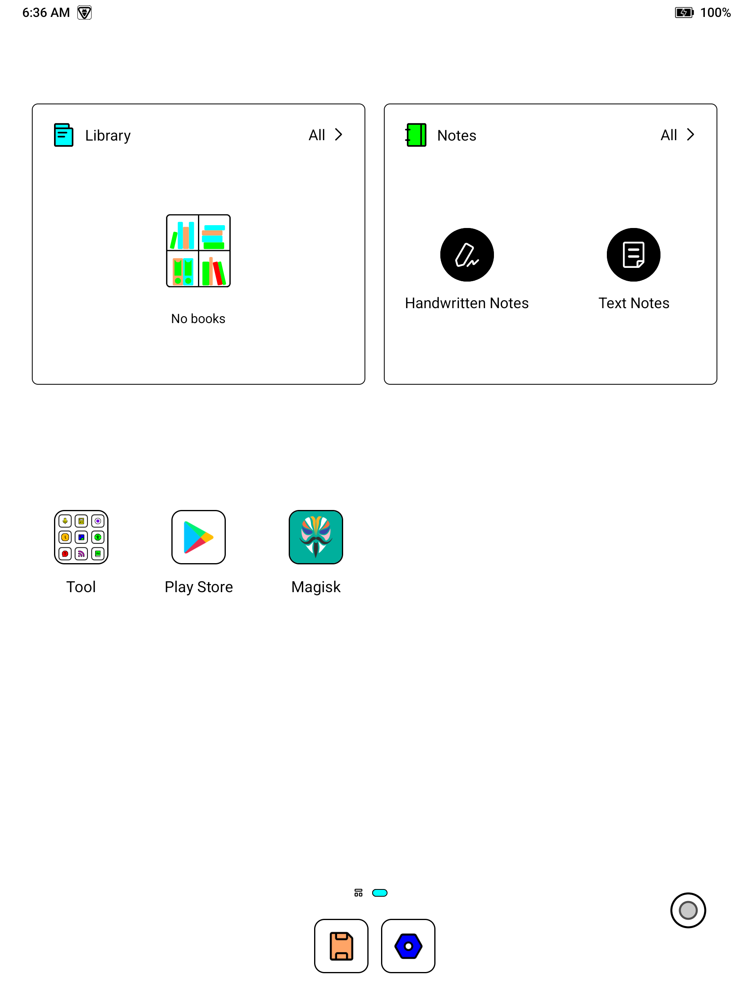

# Note Air 5C root assistant

A resumable Windows, Linux, and macOS rooting assistant for a user-owned BOOX Note Air 5C. It backs up the tablet through Qualcomm EDL, patches the device's own active boot image with pinned Magisk binaries, changes only the validated `devinfo` unlock bytes, verifies every write by reading it back, and retains a guarded stock-restore route.

The complete workflow has been exercised successfully on firmware 4.2.1 build `rel_0702_038ed12af`: full EDL backup, verified writes, factory reset, Magisk 30.7 initialization, and a live `uid=0(root)` shell. Other firmware remains subject to the allow-list policy below.

> [!CAUTION]
> **Rooting with this project resets the tablet and erases its local data.** The unlock transition invalidates Android's existing data-encryption keys; apps, accounts, settings, downloaded books, notes that are not separately exported/synced, and files stored only on the tablet can be lost. Returning to the locked state can require another reset. Back up anything you care about somewhere outside the tablet before starting.
>
> Rooting can brick or boot-loop the device, void or complicate warranty/service, weaken platform security, break DRM, Play Integrity/attestation, banking or streaming apps, corporate MDM/Intune access (including Outlook), and interfere with BOOX OTA updates. Privacy/debloat profiles intentionally disable some BOOX online features. Firmware updates can invalidate every device-specific assumption in this repository.
>
> **This software is provided “as is”, without warranty. The authors and contributors take no responsibility for data loss, device damage, account loss, warranty consequences, security incidents, unavailable services, or any other direct or indirect damage. You are solely responsible for reviewing the code, understanding each confirmation, maintaining offline backups, and deciding whether to proceed.**

This is deliberately not an unattended “plug in and forget it” root. Android recovery reset, ADB authorization, and Magisk's one-time setup remain visible human checkpoints. Destructive stages require exact confirmation phrases.

## Result

The optional clean-home step groups BOOX shortcuts into **Tool**, keeps only Play Store and Magisk as desktop app icons, preserves the Library and Notes widgets, and leaves only Storage and Settings in the dock.



## Capabilities

| Area | What the assistant does |
|---|---|
| Guided root | Arrow-key UI, resumable checkpoints, exact destructive confirmations, and manual checkpoint instructions |
| Device proof | Requires exactly `NoteAir5C`, an allow-listed firmware fingerprint, known A/B slot, sufficient battery, expected GPT, and validated `devinfo` structure |
| Private backup | Reads and hashes every partition except `super` and `userdata`, including device identity, calibration, DRM/attestation, and recovery-critical partitions |
| Boot patch | Patches the tablet's own active boot image with pinned Magisk 30.7 tooling and structurally verifies it before writing |
| Write safety | Proves the EDL write path on inactive-slot `dtbo`, then reads every material write back and compares a source-length SHA-256 |
| Root proof | Verifies unlocked/orange verified-boot state, Magisk version, exact firmware/slot, and a live `uid=0(root)` shell |
| Stock recovery | Restores the matching stock boot image and only the validated lock bytes from the same private run |
| Privacy | Audits BOOX packages/endpoints, installs a systemless hosts/firewall module, offers reversible debloat/purge, and records exact restore state |
| Vendor Lockdown | Systemlessly removes cloud sync and denies WAN for dedicated `com.onyx` app UIDs while preserving shared Android networking services |
| Clean launcher | Atomically backs up, validates, normalizes, verifies, and can restore the BOOX launcher SQLite layout |
| Host support | One PowerShell state machine with native Windows, Linux, and macOS launchers/tool downloads |

## Supported hosts

The safety state machine is shared on all three hosts through PowerShell. The launchers and downloaded Android binaries are native to each OS.

| Host | Launcher | First-run host setup |
|---|---|---|
| Windows 10/11 | `Start-NoteAir5C.cmd` | Python/Git through `winget`; Zadig may be needed once for Qualcomm 9008 |
| Native Linux | `./Start-NoteAir5C.sh` | `apt`, `dnf`, or `pacman` packages plus a scoped udev rule through `sudo` |
| macOS | `./Start-NoteAir5C.sh` | Python, Git, libusb, and xz through Homebrew |

PowerShell 7 (`pwsh`) is required on Linux and macOS. The `.sh` file is intentionally a native launcher rather than a second rooting implementation, so resume files, safety gates, and write verification cannot drift between platforms. WSL is not treated as a supported Linux host because direct Qualcomm USB/EDL access is not reliably equivalent to native Linux.

The main menu is keyboard-driven: use Up/Down or Left/Right to move, Enter to select, `1`-`7` as direct shortcuts, and Esc or `Q` to quit. Redirected input automatically falls back to a typed prompt for scripts and tests.

## Main menu

| Option | Purpose |
|---|---|
| **1 — Start / Continue Root** | Starts a new guarded run or resumes the newest verified checkpoint through backup, patch, unlock, reset, Magisk setup, and final proof. |
| **2 — Verify Root** | Read-only proof of model, firmware, slot, boot lock/verified state, Magisk version, and root shell. |
| **3 — Status** | Shows USB/tool readiness, the latest private run, and what its current checkpoint means. |
| **4 — Setup / Repair Tools** | Downloads pinned artifacts, verifies size/SHA-256, creates the EDL Python environment, and offers host USB/dependency setup. |
| **5 — Return Fully to Stock** | Restores any recorded privacy/package/launcher changes while root is still available, then restores stock boot, relocks, and guides the required userdata reset. |
| **6 — Safe UI Preview** | Renders the complete walkthrough without accessing or changing a tablet. |
| **7 — Privacy Hardening** | Opens the audit, firewall, purge, Vendor Lockdown, clean-home, and exact-state restore submenu. |
| **Q — Quit** | Exits without making a new change. |

## Quick start

### Requirements

- A **BOOX Note Air 5C** you own and are authorized to modify. Adjacent BOOX models are rejected.
- At least 50% tablet battery and a reliable USB data cable connected directly to the host where possible.
- A Windows 10/11, native Linux, or macOS host with PowerShell 7; administrator/`sudo` access is needed for some first-run USB/dependency setup.
- Internet access for the pinned tool/artifact downloads and substantial free disk space for private partition backups.
- A separate backup of books, notes, downloads, authentication material, and anything else stored only on Android userdata.
- Willingness to complete recovery reset, minimum Android setup, repeated ADB authorization, and Magisk's one-time initialization when instructed.

### Windows

Double-click `Start-NoteAir5C.cmd`, or run:

```powershell
pwsh ./Start-NoteAir5C.ps1
```

### Linux

Install [PowerShell 7 for your distribution](https://learn.microsoft.com/powershell/scripting/install/installing-powershell-on-linux), then:

```sh
chmod +x Start-NoteAir5C.sh
./Start-NoteAir5C.sh
```

Choosing **Setup / repair tools** can install the required packages through `apt`, `dnf`, or `pacman`. It also installs `config/51-noteair5c.rules`, scoped to BOOX USB vendor `2d95` and Qualcomm EDL `05c6:9008`. Reconnect the cable after setup so udev applies the rule. The EDL rule tells ModemManager to ignore the 9008 interface.

### macOS

With [Homebrew](https://brew.sh) installed:

```sh
brew install --cask powershell
chmod +x Start-NoteAir5C.sh
./Start-NoteAir5C.sh
```

Choosing **Setup / repair tools** installs the EDL runtime dependencies through Homebrew. Reconnect the cable if the first Qualcomm 9008 probe is not visible.

### Safe interface preview

This renders the entire walkthrough without accessing the tablet:

```powershell
pwsh ./Start-NoteAir5C.ps1 -Action Demo
```

Use `-Plain` for ASCII with no color, `NO_COLOR=1` to disable color, or `NOTEAIR5C_ASCII=1` to keep color but avoid Unicode glyphs.

## What remains manual

Android deliberately prevents a truly unattended first-time root. The assistant pauses and tells you when to:

1. Enable BOOX USB Debug Mode.
2. Approve this computer's ADB key.
3. Confirm the destructive phase by typing `ERASE NOTEAIR5C`.
4. Complete the recovery factory reset after the lock-state change.
5. Complete minimum Android setup and approve USB debugging again.
6. Finish Magisk's one-time setup if requested.

The lock-state transition invalidates the existing `/data` encryption keys. Local files and apps will be lost. The EDL backup intentionally does not claim that encrypted userdata can be restored.

## Safety model

The assistant refuses partition writes until all of these pass:

- ADB model and device are exactly `NoteAir5C`.
- Battery is at least 50%.
- The active A/B slot is known.
- The exact firmware fingerprint and active slot still match immediately before patching.
- The Qualcomm GPT contains the expected partitions.
- Every partition except `super` and `userdata` has been backed up.
- The private backup manifest and SHA-256 hashes verify.
- All critical boot, identity, and calibration partitions are present.
- A byte-identical inactive-slot `dtbo` rewrite reads back correctly before any material write.
- `devinfo` has the expected `ANDROID-BOOT!` magic and sanity fields.
- A boot-maintained date at offset `0x8A8` may only advance in a month-aligned form.
- Only offsets 13 and 14 change from locked to unlocked.
- MagiskBoot structurally verifies the patched image before EDL is re-entered.
- Every actual partition write reads back with a matching source-length SHA-256.

The normal path does not flash the optional community-modified ABL or FRP images.

## Guided flow and resume

The console finds the newest `state.json` and resumes from its last verified checkpoint. A normal run is:

1. Prepare and authorize the tablet.
2. Collect a read-only diagnostic.
3. Create and hash the private EDL backup, patch the active boot image, prove the write path, unlock, and flash with read-back verification.
4. Guide the recovery factory reset and minimum Android setup.
5. Install/open Magisk and guide its one-time restart.
6. Prove the exact firmware, active slot, unlocked/orange boot state, Magisk 30.7, and `uid=0`.

If a command stops while the tablet remains in EDL, that is intentional. The assistant never resets the device after a failed write/read-back comparison.

## Privacy hardening and reversible debloat

Choose **Privacy Hardening** from the arrow-key main menu. It contains:

| Option | Changes | Main tradeoff |
|---|---|---|
| **Read-only privacy audit** | Records exact model/serial/firmware/root proof, relevant packages and UIDs, connectivity settings, active Magisk profile, hosts state, firewall state, and Lockdown UID inventory. | No changes. |
| **Balanced (recommended)** | Blocks documented BOOX/Onyx hosts and the cleartext bootstrap IP; user-uninstalls iGet Shop, BOOX AI, BOOX App Market, production test, and vendor Chromium; makes EasyTransfer LAN-only. | BOOX cloud endpoints and bundled commercial extras stop working. |
| **Systemless Purge** | Applies Balanced and adds Magisk `.replace` overlays so those five optional APK directories do not exist in the running system. Also applies the clean home layout. | Requires a reboot to apply and another to reveal factory APKs during restore. |
| **Vendor Lockdown (compatible)** | Applies Purge, systemlessly removes `ksync`, and denies WAN for every dedicated, dynamically discovered `com.onyx` application UID over IPv4 and IPv6. Shared/system UIDs below 10000 are always excluded. Reasserts packages/settings every 60 seconds. | BOOX Cloud/sync, online OTA checks, and internet features in dedicated BOOX apps will not work. Restore before OTA. |
| **Strict debloat** | Applies the endpoint firewall; disables BOOX sync and removes EasyTransfer, stock mail, recorder, music, gallery, calculator, clock, and dictionary for user 0. | Removes more user-facing utilities; install replacements first. |
| **Apply clean home layout** | Groups BOOX shortcuts in Tool; keeps only Play Store/Magisk on the desktop; keeps Storage/Settings in the dock; preserves Library/Notes widgets. | Briefly restarts the launcher. Exact DB backup/rollback is created first. |
| **Restore previous state** | Uses only the newest matching record to remove the module/firewall, reveal/reinstall packages, restore enabled states and settings, and restore the prior launcher DB. | Reboots when a systemless overlay was active. |

Every profile refuses unsafe per-app firewall rules for UIDs below 10000 because the BOOX launcher and `ksync` share Android UID 1000 with core system services. Blocking that UID also breaks unrelated DNS, Google account registration, and Microsoft connectivity. Vendor Lockdown therefore targets dedicated BOOX application UIDs, systemlessly removes `ksync`, and keeps the explicit Magisk `/system/etc/hosts` overlay plus hardcoded bootstrap-IP rejection. EasyTransfer retains only local-network access in Balanced, Purge, and Vendor Lockdown.

Balanced and Strict package “uninstall” is Android's reversible `pm uninstall --user 0`; APKs remain in the read-only system image. Purge adds narrowly validated Magisk `.replace` directories for the five optional `/system/app` paths. Android cannot see or execute those APKs after reboot, but no factory partition is modified and removing the module reveals them again. Purge restore therefore reboots first, then returns every package to its recorded install/enabled state and verifies the result. Strict mode uses `disable-user` for shared-UID `ksync`.

Purge and Vendor Lockdown automatically apply the clean-home layout. Before any launcher change, the assistant stops the launcher briefly, copies `AppDatabase.db` into the matching recovery run, checks SQLite integrity and the exact BOOX 4.2.1 schema, and edits a host-side copy. Installation is atomic and has a second device-side rollback copy. Privacy Restore puts the prior launcher database back. Unknown launcher versions, schemas, missing reference items, incomplete Tools folders, hash mismatches, or post-install verification failures are refused.

Vendor Lockdown is the strongest compatibility-preserving mode. At installation it records current dedicated BOOX application UIDs into the module, installs their WAN-deny rules before Android finishes booting, rediscovers `com.onyx` packages after startup, and checks again every 60 seconds. Shared/system UIDs below 10000 are deliberately excluded. BOOX Cloud/sync, online OTA checks, and internet features in dedicated BOOX apps will not work; restore before an OTA. This is a direct-network guarantee for the dedicated BOOX package UIDs plus the listed host/IP policy—not a claim that unknown future endpoints or arbitrary third-party applications can never contact Chinese infrastructure. A literal device-wide guarantee requires disabling all WAN traffic.

The hostname policy is deliberately explicit rather than blocking every `.cn` domain. It is based on the documented [BOOX endpoint and application analysis](https://gist.github.com/jdkruzr/fb4b452b8734f8b42ff0b04a03ce70e9), the earlier [BOOX DNS blacklist](https://gist.github.com/quells/2f5fdb0669f87104ef80d408c761f77a), and established [BOOX hardening practice](https://gist.github.com/fardjad/97baf36de97d1c4ae3953b3d359bb918). UAD-NG recommends disabling uncertain packages rather than deleting system APKs; the strict profile follows that guidance for the shared system-UID service.

This is defense in depth, not a claim of perfect network isolation. A future firmware can add new endpoints or hardcoded IPs. Run the audit again after every OTA, restore stock before installing an OTA, and rebuild/review the privacy policy for the new firmware before reapplying it.

Direct privacy commands:

```powershell
pwsh ./Root-NoteAir5C.ps1 -Command PrivacyAudit
pwsh ./Root-NoteAir5C.ps1 -Command PrivacyHome
pwsh ./Root-NoteAir5C.ps1 -Command PrivacyHarden -PrivacyProfile Balanced
pwsh ./Root-NoteAir5C.ps1 -Command PrivacyHarden -PrivacyProfile Purge
pwsh ./Root-NoteAir5C.ps1 -Command PrivacyHarden -PrivacyProfile Lockdown
pwsh ./Root-NoteAir5C.ps1 -Command PrivacyHarden -PrivacyProfile Strict
pwsh ./Root-NoteAir5C.ps1 -Command PrivacyRestore
```

## Direct engine commands

The guided console is recommended. These commands expose the guarded engine for troubleshooting and deliberate automation:

```powershell
pwsh ./Root-NoteAir5C.ps1 -Command Setup -InstallHostDependencies
pwsh ./Root-NoteAir5C.ps1 -Command Diagnose
pwsh ./Root-NoteAir5C.ps1 -Command Backup
pwsh ./Root-NoteAir5C.ps1 -Command Root
pwsh ./Root-NoteAir5C.ps1 -Command Status
```

Non-interactive root still stops at the Android reset/setup boundary:

```powershell
pwsh ./Root-NoteAir5C.ps1 -Command Root -AcknowledgeDataWipe -NonInteractive
pwsh ./Root-NoteAir5C.ps1 -Command Resume -RunPath './runs/<run>' -AcknowledgeDataWipe -NonInteractive
```

Copy the resulting `runs/<timestamp>-<serial>/` directory to separate offline storage. It contains device-unique keys, identity, DRM/attestation material, and calibration data. Never publish or commit it.

## Firmware policy

These exact builds are enabled by default:

```text
Onyx/NoteAir5C/NoteAir5C:11/2026-04-02_19-54_4.2-rel_0402_75ba17df0/2413:user/release-keys
Onyx/NoteAir5C/NoteAir5C:11/2026-07-02_19-03_4.2.1-rel_0702_038ed12af/3055:user/release-keys
```

Firmware 4.2.1 build `rel_0702_038ed12af` is device-validated and enabled by default. Unknown or unconfirmed firmware is rejected unless `-AcceptUntestedFirmware` is explicitly supplied. That override does not skip model, partition, backup, layout, or write-verification gates.

Never resume an old run after an OTA or active-slot change. Start a new diagnostic and backup instead.

## Return to stock

Use the same run that created the root. **Return Fully to Stock** first removes the recorded privacy Magisk module and restores the exact saved package, settings, and launcher state while root is still available. It reboots and verifies that recovery, then validates the private partition backup, checks the live firmware and active slot, restores the original active-slot boot image, changes only the current `devinfo` lock flags back to locked while preserving its newer monotonic date, and reads both partitions back before resetting:

```powershell
pwsh ./Root-NoteAir5C.ps1 -Command ReturnStock -RunPath './runs/<run>'
```

For unattended use, add both `-AcknowledgePrivacyRestore` and `-AcknowledgeDataWipe`; interactive use asks for exact confirmation phrases. Changing back to locked invalidates userdata encryption again, so expect Android Recovery to require **Factory data reset** before stock Android can boot.

The lower-level `Restore` command skips privacy-state recovery and is retained only for troubleshooting. The explicit emergency route is only for a genuinely non-booting tablet already in EDL:

```powershell
pwsh ./Root-NoteAir5C.ps1 -Command Restore -RunPath './runs/<run>' -AcknowledgeDataWipe -ForceEmergencyRestore
```

This skips only the unavailable Android fingerprint/slot check and the unexpected-current-boot refusal. Backup, GPT, `devinfo`, source-image, and write/read-back gates remain active.

Do not accept a BOOX OTA while rooted. Restore stock first, install the OTA, then create a fresh run for the newly active slot.

## Offline tests

Tests exercise firmware matching, adjacent-model rejection, GPT gates, slot normalization, artifact metadata, platform-specific tool selection, exact `devinfo` changes, monotonic-date handling, launcher coverage, and stock re-lock behavior without connecting to the tablet:

```powershell
pwsh ./Root-NoteAir5C.ps1 -Command SelfTest
```

## Project layout

```text
Root-NoteAir5C.ps1              command entry point
Start-NoteAir5C.ps1             cross-platform guided console
Start-NoteAir5C.cmd             Windows launcher (prefers PowerShell 7)
Start-NoteAir5C.sh              Linux/macOS launcher
src/NoteAir5C.Root.psm1         shared state machine and safety gates
src/NoteAir5C.Privacy.psm1      privacy, package, firewall, and launcher recovery engine
src/boox_home_layout.py         schema-gated BOOX launcher SQLite normalizer
config/artifacts.json           pinned per-OS downloads, sizes, and hashes
config/firmware-profiles.json   firmware allow-list and observations
config/51-noteair5c.rules       scoped Linux BOOX/EDL USB access
config/privacy-policy.json      documented hosts, profiles, and protected apps
privacy/magisk-module/          systemless hosts and scoped app firewall
docs/home-screen.png            validated clean-home result shown above
tests/Run-Tests.ps1             offline self-tests
runs/                           private backups and state (gitignored)
.tools/                         per-OS isolated tools (gitignored)
.cache/                         verified downloaded artifacts (gitignored)
```

See [THIRD_PARTY.md](THIRD_PARTY.md) for upstream provenance and attribution.
